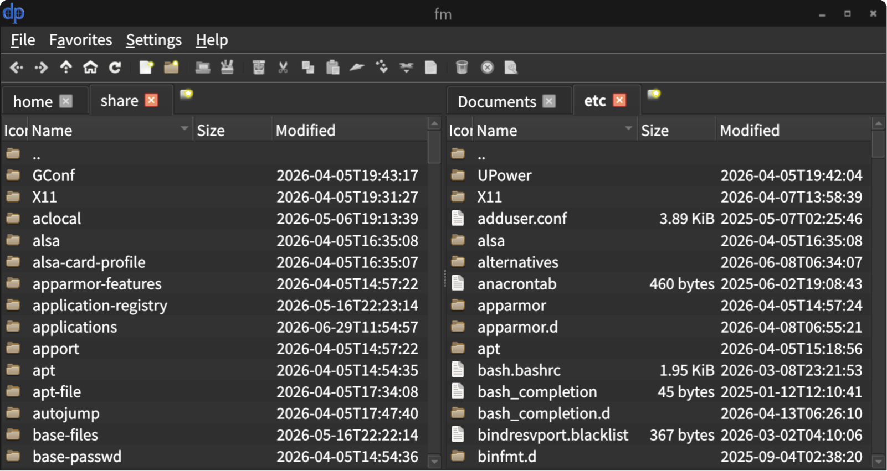

# fm — Linux 双面板文件管理器

基于 Qt6 Widget 的轻量级双面板文件管理器，支持多选项卡、文件操作、收藏管理、会话恢复与卷管理。



## 功能特性

- **双面板布局**：左右或上下布局可切换，独立调整比例，支持单面板隐藏
- **多选项卡**：每个面板可打开多个标签页，独立导航历史，支持拖拽排序、克隆、关闭
- **文件操作**：复制、移动、重命名、删除、回收站、属性查看，异步执行带进度对话框
- **冲突处理**：复制/移动遇同名文件时提供覆盖/跳过/重命名/全部应用选项
- **收藏管理**：保存当前双面板布局与各标签路径，一键恢复
- **会话恢复**：自动保存/恢复上次窗口状态、面板布局、标签路径与排序
- **卷管理**：文件菜单列出已挂载卷（QStorageInfo）与外部可移动设备（UDisks2），支持挂载/卸载/弹出
- **剪贴板**：剪切/复制/粘贴，跨面板剪切/复制，复制路径/文件名
- **可配置快捷键**：所有快捷键可通过设置对话框自定义，实时生效
- **主题与图标**：界面主题（QStyleFactory）、图标主题可配置
- **多语言**：中文 / 英文切换

## 依赖

### 运行时

```bash
sudo apt install libqt6widgets6 libqt6concurrent6 libqt6dbus6 libqt6network6 \
    udisks2 gnome-icon-theme
```

### 开发工具

```bash
sudo apt install build-essential cmake qt6-l10n-tools
```

### 开发库

```bash
sudo apt install qt6-base-dev qt6-base-dev-tools
```

## 构建

```bash
cd fm-qt
cmake -B build -DCMAKE_BUILD_TYPE=Release
cmake --build build
```

构建产物位于 `build/fm`。

## 安装

```bash
sudo cmake --install build
```

默认安装到 `/usr/local/bin/fm`。

## 运行

```bash
./build/fm
```

或安装后直接运行：

```bash
fm
```

程序启动时会自动恢复上次会话。若已有实例运行，新进程会将已运行的窗口提到前台并退出（单实例模式）。

## 配置

配置文件位于 `~/.config/fm/fm.conf`（INI 格式），所有配置可通过"设置"对话框修改，实时生效。

## 默认快捷键

| 快捷键 | 功能 |
|---|---|
| `Ctrl+X` / `Ctrl+C` / `Ctrl+V` | 剪切 / 复制 / 粘贴 |
| `F5` / `F6` | 复制到对面 / 剪切到对面 |
| `Ctrl+N` / `F7` | 新建文件 / 新建文件夹 |
| `Ctrl+Shift+O` | 打开... |
| `Return` / `F2` | 打开 / 重命名 |
| `Delete` / `Shift+Delete` | 移到回收站 / 彻底删除 |
| `Alt+←` / `Alt+→` / `Alt+↑` | 后退 / 前进 / 上一级 |
| `Ctrl+R` | 刷新 |
| `Ctrl+T` / `Ctrl+W` / `Ctrl+Shift+T` | 新建标签 / 关闭标签 / 克隆标签 |
| `Ctrl+Tab` | 切换活动标签 |
| `Tab` | 切换活动面板 |
| `Ctrl+H` | 显示/隐藏 .开头文件 |
| `Alt+Return` | 属性 |

所有快捷键均可在设置对话框中自定义。

## 项目结构

```
fm-qt/
├── CMakeLists.txt
├── README.md
├── REQUIREMENTS.md              # 需求规格文档
├── ARCHITECTURE.md              # 架构设计文档
├── src/
│   ├── main.cpp                 # 程序入口
│   ├── app/                     # 应用初始化、单实例
│   ├── core/                    # 配置、剪贴板、收藏、会话、快捷键、卷管理
│   ├── dialogs/                 # 设置、冲突、属性、打开方式等对话框
│   ├── filelist/                # 文件列表模型、视图、排序代理
│   ├── fileops/                 # 文件操作、进度、回收站
│   ├── panel/                  # 面板容器、面板组件、标签栏
│   └── ui/                     # 主窗口
└── translations/                # 中英文翻译 (.ts / .qm)
```

## 贡献

欢迎提交 Issue 和 Pull Request。

- 提交前请确保代码能通过编译
- 新增功能请同步更新 [REQUIREMENTS.md](REQUIREMENTS.md) 与 [ARCHITECTURE.md](ARCHITECTURE.md)
- 涉及用户可见文案时请补充 `translations/` 下的翻译

## 许可

本项目采用 **GPL v3** 开源许可证，与 Qt6 开源许可证一致。详见 [LICENSE](LICENSE)。
